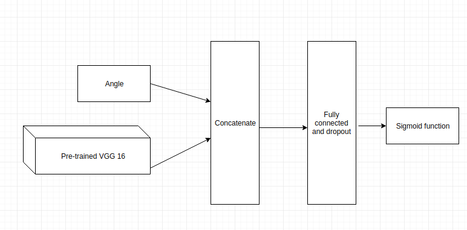

# Iceberg/Ship Image Classification
Kaiyuan Hu  
Nov 21st, 2017

## I. Definition

### Project Overview

Image recognition and classification is one of the most difficult and hottest in computer vision area. Recently, Convolutional neural network(CNN) arise a lot of attention in this area. In 2014, Simonyan, Karen, and etc. proposed a CNN architecture named VGG-16, which gained 92.4% classification accuracy in ILSVRC-2012 dataset. In 2015, Keming, He and etc, proposed a awesome CNN architecture named ResNet-152, which have 152 layers and gained about 95% image classification accuracy, a superhuman accuracy, on the ImageNet dataset.

As show in the figure, CNN architecture usually take images as input, followed by several convolutional layers and pooling layer, which also called neural network. Finally, CNN architecture use softmax layer or sigmoid layer as classifier to generate classification result.

Kaggle hold a Data science competition on-line named Statoil/C-CORE Iceberg Classifier Challenge. The mainly goal for this competition is to find a model that can correctly classify Iceberg from Ship according to the Image they provided.

The dataset for this competition have three different input: band_1, band_2 and angle. The band_1 is a 75*75 pixels flattened grayscale image taken by satellite that transmit and receive horizontally. Then band_2 is another 75*75 pixel flattened grayscale image taken by satellite that transmit horizontally and receive vertically. The angle is the incidence angle of which the image was taken. The output for this dataset is either 1 or 0. 1 means their is an Iceberg object inside those image and 0 means their is a ship object inside those image. The main goal for the competition is to find a model that can correctly return 1 or 0 according to those provided inputs. There are 1604 total samples in training dataset and 8424 total samples in test dataset. Here are some samples images.

### Problem Statement

This is an iceberg/ship binary image classification problem, so Convolutional neural network(CNN) seems a good model for this problem. The mean goal for this model is to map those three input into a probability, when output probability greater than 0.5 that means there is an Iceberg inside the Image and when probability smaller than 0.5 that means their is a ship inside the image. CNN already proof its extraordinary ability in Image classification. Since their are only 1604 training sample inside the training dataset, which means training sample is not enough, transfer learning method seems necessary for this problem. The input image size is only 75*75 pixels which is not large enough for some famous CNN architecture such as ResNet50, so VGG-16 or VGG-19 architecture seems good fit for this model.  

Based on the information above, I proposed a VGG-16 transfer leaning model. Firstly, I will import Convolutional layers from VGG-16 model that pre-trained by ImageNet. Then use concatenate layer to combine angle information with image information. After that i will add some fully connected layers and dropout layers. Finally, I will use the sigmoid function as the classifier. Here is the model architecture.

### Metrics

Since this is a ongoing competition on Kaggle, I do not have the target value for the test dataset. Hence, I will use 20% of value inside the training dataset as the test dataset and I will not train the model based on those 20% training data.

 I will use accuracy score to measure the performance of the model. Here is the formula to calculate accuracy score.

accuracy score = (True positive  + True negative)/(Total sample)

Since I will use sigmoid function as the classifier in the final layer, the model will generate a probability for each input. For each of those output, I will assign the value to 1, if the probability greater than 0.5 and I will assign the value to 0, if the probability smaller than 0.5. After that, I will compare the predict value with the target value and calculate the accuracy score based on those information.

After that, I will use the whole training dataset to train the model and generate the prediction result of test dataset. I will submit those results to Kaggle. Kaggle will return a log loss score for the prediction result. This is another measurement for the model. Here is the formula for log loss.

Where N is the number of samples or instances, M is the number of possible labels, yij is a binary indicator of whether or not label j is the correct classification for instance i, and pij is the model probability of assigning label j to instance i.

Actually, minimising the Log Loss is basically equivalent to maximising the accuracy of the classifier. So, log loss is also a good matrix.

## II. Analysis

### Data Exploration

There are three input fields for this dataset: band_1, band_2 and angle. The band_1 is a 75*75 pixels flattened grayscale image taken by satellite that transmit and receive horizontally, which means there are 75*75 equals 5635 elements in band_1. The band_2 is also a 75*75 pixels flattened grayscale image taken by satellite, but it transmit horizontally and receive vertically and their are also 5635 elements inside the band_2. The type for every element inside band_1 and band_2 is float. The angle is the incidence angle of which the image was taken which is also a float type variable. Their are 133 angle values are missing in the training dataset. I use pad method to fulfill those values. The variable id is just the id for this image. The detail of the data processing will be discussed in data processing part. Here is some sample training data.

### Exploratory Visualization

Here is a visualization sample for the data. The first row denote the Iceberg and the second row denote the Ship. HH means this image was taken and received horizontally and HV means the image was taken horizontally and receive vertically.

As we can see in those figures, Iceberg seems to be tiny object inside an Image and ship seems to be a long object inside an Image.

### Algorithms and Techniques

Convolutional neural network(CNN) is one of the most successfully technology in image classification. In 2014, a CNN architecture named VGG-16 gained 92.4% classification accuracy in ILSVRC-2012 dataset. In 2015, an awesome CNN architecture named ResNet-152, which have 152 layers and gained about 95% image classification accuracy on the ImageNet dataset. So, CNN is appropriate for this task.

Transfer learning is a technology that can be used when training sample is not enough. For this project, I only have about 1800 training sample. So, transfer learning method with be apply. Transfer learning is kind of using the trained parameters of other dataset and apply those parameters for the new task.

For this model, I will mainly use five different layers: convolutional layer, maxpooling layer, concatenate layer, dropout layer and fully connected layer.

Convolutional layer: Convolutional layer is kind of filter that extract specific features inside an image.

 Maxpooling layer: Maxpooling layer, which is used to highlight the moset important features, usually assigned after Convolutional layer.

 Concatenate layer: Concatenate layer is used to stack two or more layers' output together.

 Dropout layer: dropout layer is usually used between fully connected layer. It used to drop some connection between fully connected layer to prevent overfitting.

 Fully connected layer: fully connected layer is the basic layer in deep learning, which usually used in high dimensional classification problem.

This model will have two inputs, one is the processed image(I will discuss the detail in data preprocessing part.) and another is angle information. The data type for the image is a 75*75 matrix. Each element in this matrix is a float type variable and denote a greyscale pixel. The data type for angle is also float.

Here is detail information for this model. The image input will go throguh a VGG-16 architecture first, which is pre-trained by ImageNet. The main propose for this step is to use VGG-16 net to extract important features inside the image. Then, the output of the VGG-16 net will feed into a GlobalMaxPooling layer. After that, I will use a concatenate layer to merge the output of the GlobalMaxPooling layer and the second input, the angle. In addition, I will use dropout layer to prevent overfitting. Finally, I will use sigmoid function to generate final probability.

### Benchmark

The benchmark is proposed by noobhound. His model is simplified VGG-16 model without any pre-trained parameters. The main difference for his model and the VGG-16 model is he uses few convolutional layers inside his model.

Here is the accuracy score for the benchmark model. I obtained this score by using 80% of the data inside training dataset as the training data and using 20% of the data inside the training dataset as the test data.

The accuracy for the benchmark model is 61.05%.

## III. Methodology

### Data Preprocessing

There are two main parts for the data preprocessing: one is image processing and another is angle processing.

##### Image processing

The VGG-16 architecture requires input image to be a colorful image, which means the image have the third dimension: the color dimension. For example, a image with dimension 224 x 224 x 3 means the image have 224 pixel in height and 224 pixel in weight and 3 RGB color information. However, both band_1 and band_2 are grayscale image and their are dimension is 75 x 75 x 1, which means they do not have the third dimension. Hence, I need to find a method to format a 75 x 75 x 3 image.

Honestly, the method I used to format a 75 x 75 x 3 image is really sample. I use the band_1 as the first color dimension and I use band_2 as the second color dimension. I used the average of band_1 and band_2 to format the third color dimension. Finally, I use the concatenate method inside numpy to format the 75 x 75 x 3 image.

Here is the sample image after the image processing.

##### Angle processing

There are 133 angle value in training dataset is missing as marked as 'na', so we need to find a method to fulfill those missing value. The min value for the angle is 24.754600 and the max value for the angle is 45.937500. The value is kind of consistent, so I use pad inside numpy to fulfill those missing value.

### Implementation

My development environment is ubuntu 16.04 LTS. The model is trained on Nvidia GTX 1070 and Intel 17 6700HQ.

I used Keras in python to build the model. The backend for the keras is tensorflow.

Here is the list for the required library.

| software |Version|
|:--------:|:-----:|
|Python|3.5|
|Tensorflow| 1.0.0|
|Keras|2.0.2|
|numpy|1.12.0|
|pandas|0.20.3|
|plotly|2.0.15|
|matplotlib| 2.0.0|

Here is the detail structure for the model. I already clearly state the model in lgorithms and Techniques part.

For this model, I choose adam as the optimizer. I set the learning rate equal to 0.001 and do not decease the learning rate. I also set the Fuzz factor equal to 1e-08, which is the default value. I set beta 1, the exponential decay rate for the first moment estimates equals to 0.9 and beta 2, the exponential decay rate for the second-moment estimates, equals to 0.999. Both value are also default value.

The batch size for the training data is 20, since the memoryu size for the GPU is only * GB. The epochs for the training is 100.  The dropout rate for the dropout layer is 0.2. Actually, I was trying different dropout rate, such as 0.25 and 0.3, but it did not great effect the result.

Finally, the best accuracy score for this model on test dataset is 69.41%.

### Refinement

##### More fully connected layer and GlobalMaxPooling layer
Initially, I have two model fully connected layers before the final sigmoid classifier. Each dense of the fully connected layer is set to 512. However, If add those layer into the model, it will make the model hard to converge no matter whether the dense is set to 512 or 256 or 1024. What's more, those two fully connected will greatly slow down the training speed. So I remove those two fully connected layers and add a GlobalMaxPooling layer. The GlobalMaxPooling layer works really well.

##### Dropout layer

Add a dropout layer between the GlobalMaxPooling layer and the final classification layer can help increase 0.5% accuracy. However, the dropout rate is not that significant. Setting dropout rate to 0.2, 0.25 and 0.3 will generate very similar result.

##### Xception

For final model, I use VGG-16 model as the basic pre-trained model. Actually, I did try another model: Xception. Xception  is much deeper than VGG16 model and perform better than VGG-16 in image classification on ImageNet. However, since Xception is much deeper than VGG-16, this means more parameters need to be trained for this model and the training speed will slower than VGG-16 model. Finally, the accuracy score for using Xception is 0.9% higher than using VGG-16 model. Finally, I still decided to use VGG-16 model, since VGG-16 model is more efficient. 

##### Learning Rate
Actually, I choose 0.1 as the learning rate for the adam optimizer for the first time. However, the model with this learning rate did not converge. So, I decrease the learning rate from 0.1 to 0.001. This learning rate works well. When I set the learning to 0.001, the decay of the learning seems did not matter for this model.

## IV. Results

### Model Evaluation and Validation

The accuracy score for this transfer learning model is 67.73%. The training epochs for this model is 100. It takes about 3 mins in training the model on Nvidia GTX 1070 and Intel 17 6700HQ.

The optimizer for this model is adam and the the learning rate is 0.001 with no decay rate is 0. The beta 1 is set to 0.9 and beta is set to 0.999.

Here is the sample test input and output.

 Angle: 38.1562.    Output: 0.2173.  Target value: 0, ship.

 Angle: 45.2859.    Output: 0.8104.  Target value: 1, Iceberg.

Their indeed a little overfitting for this model. After training, this model gains 91% accuracy in training dataset, but only have 67% accuracy on test dataset. So, my further work will deal with the overfitting problem.

I use ImageDataGenerator in keras to shift the original image and use the new data to re-train the model. The new model gained accuracy score of 69.41%, which is a better result than original and the model with those new parameters are shift invariate.

### Justification

As state above, the accuracy score for this transfer learning model is 67.73%. Their is a little improve comparing with the benchmark model. However, this model is not good enough. This model might failed when the original greatly shifted and  67.73% accuracy is not a stronger enough accuracy score. Although there is an improve for this model comparing with benchmark model, this model is not strong enough to solve this problem. What's more, this model seems did not fully utilized the angle information, since whether add angle information or not, it will not great effect the final accuracy score.

## V. Conclusion

### Free-Form Visualization
Actually, this is a really hard binary image classification. For some sample, even human cannot distinguish Iceberg from ship.

For example, this is a sample image for ship.  The model generate output of 0.5702, which means the model think this is a Iceberg. Actually, it is even hard for human to figure out whether this is a ship or Iceberg.

### Reflection

This project is a binary image classification problem. So, firstly, I decided to use a CNN model. After that, I explore the dataset and preprocessing all those data, then I do some visualization on this dataset. During the visualization, I have deeper understanding of the data. Hence, I decided to use VGG16 transfer learning model. After building this model, I compare the performance of this model with the benchmark model. Finally, this model indeed performance better than the benchmark model.

The core part for this project is that I define a transfer leaning modified VGG-16 model. Actually, I think the most interesting part and difficult for this project is to find a good method to formation the third dimension(RGB dimension) for this image. Actually, i saw some other method to format the image. I think those method might be helpful to help CNN better understand the difference between Iceberg and ship.

I did expect that the transfer learning model will better than the benchmark model and actually the model is indeed better than the benchmark model. However, this model is still not good enough to solve this problem.

### Improvement

Actually, there are several points inside this model can be improved. Some model, like VGG-19 and ResNet, are perform better than VGG-16 in image classification. If I change the basic model for this model from VGG-16 to ResNet, the accuracy might be improved. What's more, we only use part of the training data to train the model. Honestly, we can use cross validation model to train the model. For example, we can use 2/3 of the training data to train the model and the 1/3 as the validation dataset and in next iteration, we use another 2/3 data to train the model and so on. The third point I think is way we format the training image. I use band_1, band_2 and the average of band_1 and band_2 to format the input image. Actually, I saw some better way to format the satellite image, like Derivative with Respect to X. Here is the sample. I think this method can also help.

 

# Reference

- Simonyan, Karen, and Andrew Zisserman. "Very deep convolutional networks for large-scale image recognition." arXiv preprint arXiv:1409.1556 (2014).
- https://www.cs.toronto.edu/~frossard/post/vgg16/
- He, Kaiming, et al. "Deep residual learning for image recognition." Proceedings of the IEEE conference on computer vision and pattern recognition. 2016.
- https://www.kaggle.com/muonneutrino/exploration-transforming-images-in-python
- https://matplotlib.org/users/image_tutorial.html
- https://machinelearningmastery.com/adam-optimization-algorithm-for-deep-learning/
- https://www.kaggle.com/knowledgegrappler/a-keras-prototype-0-21174-on-pl
- https://keras.io/optimizers/
- http://cs231n.github.io/
